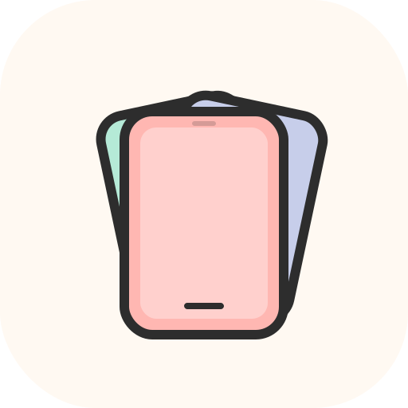

<h1>
  MobileDeck
</h1>

  
  
  

  
  
  

> <i>Seamless control across devices — your desktop, reimagined.</i>

---

## 🚀 MobileDeck v1.0.0 — Initial Launch

**MobileDeck v1.0.0** marks the **first public release** of the application, introducing a complete desktop experience with seamless mobile connectivity.

This repository contains **release builds only**.  
<b>The source code is intentionally kept private.</b>

---

## 📌 What is MobileDeck?

**MobileDeck** is a desktop companion app designed for people who need **fast access, control, and productivity** directly from their desktop.

It is especially useful for:
- 🎮 **Gamers**
- 🧪 **PC testers**
- 👨‍💻 **Developers**

Many similar tools are **premium or subscription-based**.  
**MobileDeck is built as a practical, lightweight alternative**, focused on usability and performance.

---

## 🛠 First-Time Setup (How It Works)

1. **Launch the Desktop App**
   - Starts like a normal desktop application
   - On first run, you may be asked to allow a **background service**
   - Allow it for proper functionality

2. **Click “Connect” on Desktop**
   - A QR code is generated on your PC screen

3. **Install the Mobile App**
   - Open the MobileDeck mobile app
   - Scan the QR code shown on the desktop

4. **Approve the Connection**
   - After scanning, the desktop will ask for **device approval**
   - Approve the request to complete pairing

5. **Connected — Done 🎉**
   - Your mobile device is now connected
   - No manual configuration required

---

## ✨ Features in v1.0.0

- 🧩 **Completed Dock System**
  - Launch and manage desktop apps easily

- 📱 **Desktop ↔ Mobile Connectivity**
  - Secure QR-based pairing with manual approval

- ⚡ **Background Service Support**
  - Ensures smooth and reliable communication

- 🎨 **Clean & Modern UI**
  - Optimized for daily desktop use

---

## 📱 Mobile App Status (Important)

The **mobile app UI includes**:
- 📊 **Stats screen**
- ⚙️ **Quick Settings screen**

⚠️ **Note:**  
These screens are **present but not functional in v1.0.0**.  
They are under active development and will be enabled in future updates.

---

## 🖼 Screenshots

### 🖥 Desktop App

| | |
|--|--|
|  |  |
|  |  |
|  |  |

### 📱 Mobile App

| | |
|--|--|
|  |  |

---

## 🔜 Coming Soon

- 📊 **System Stats**
  - CPU usage
  - Memory usage
  - Performance insights

- ⚙️ **Quick Settings**
  - Volume control
  - Brightness control
  - System shortcuts

---

## 🧪 Release Notes

- Version: **v1.0.0**
- Type: **Initial Public Release**
- Platform: **Windows (x64)**

Minor bugs may exist. Feedback is welcome and appreciated.

---

<b>Welcome to MobileDeck 🚀</b>  
More features and updates coming soon.

