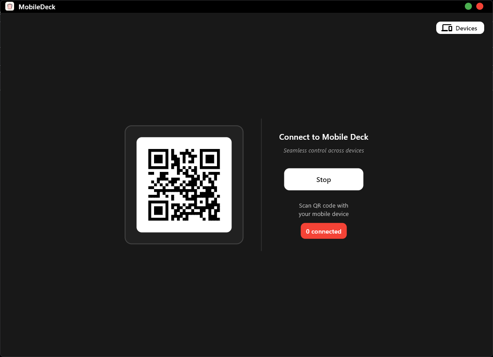
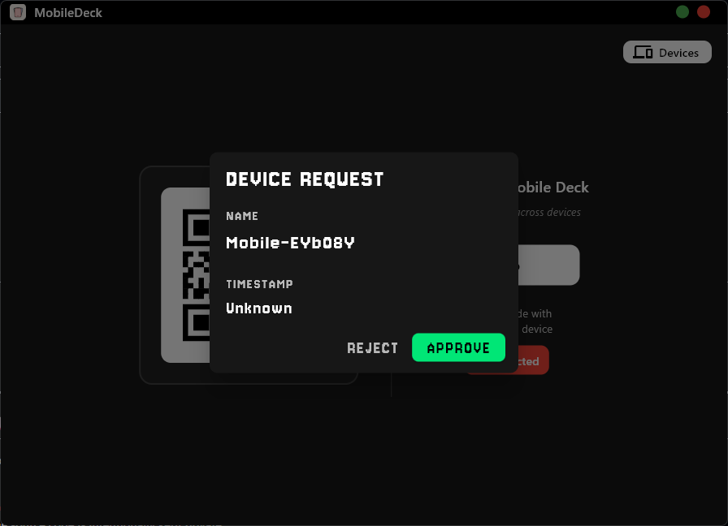
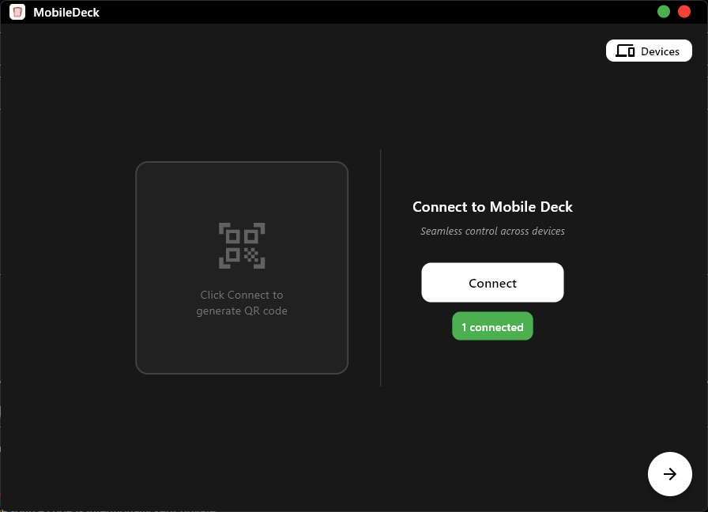
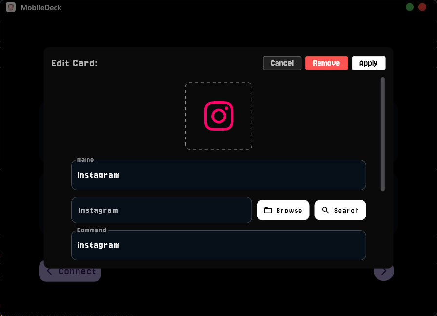
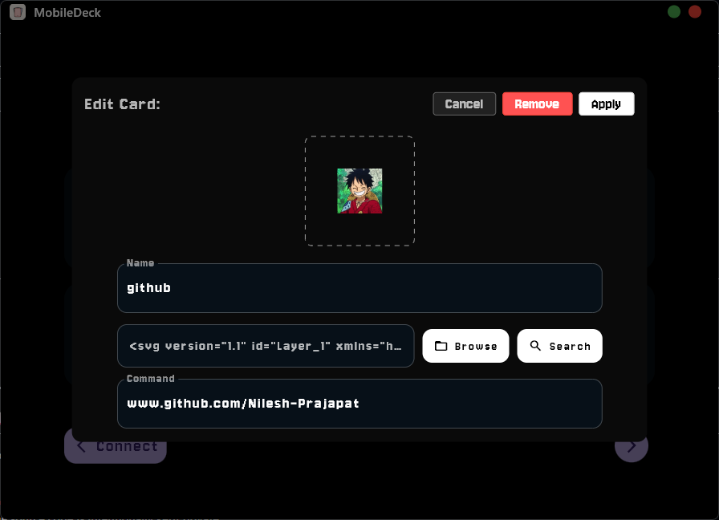
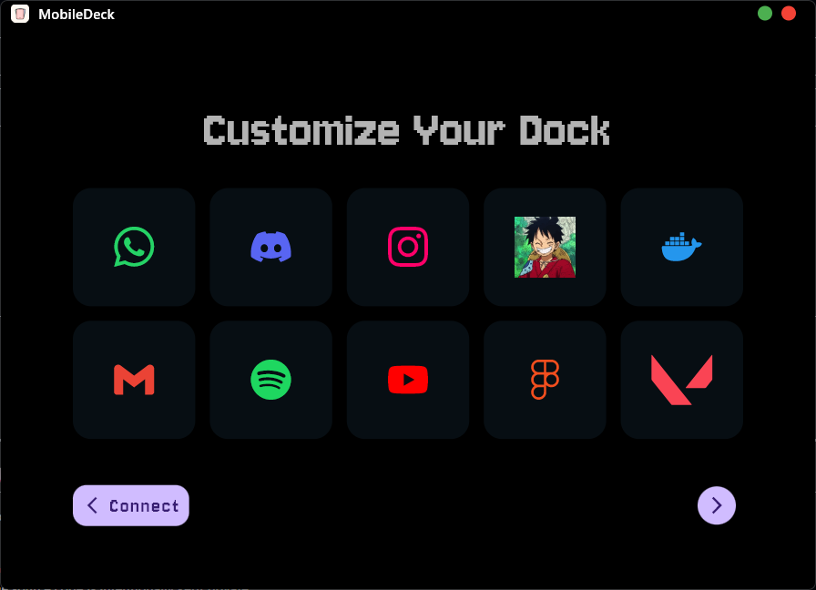
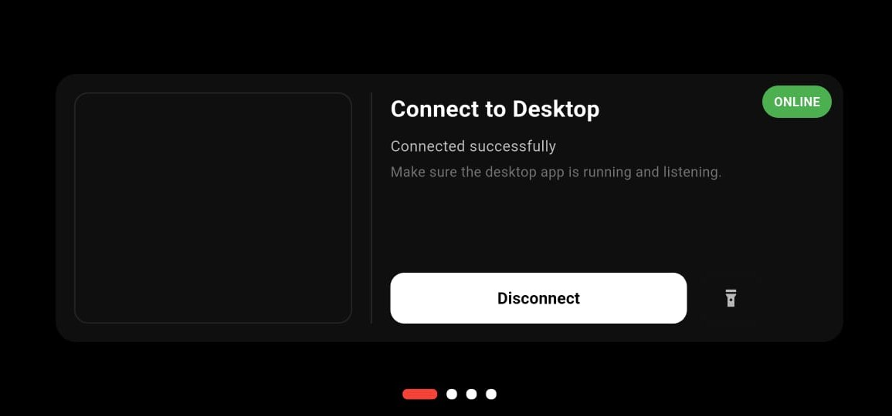
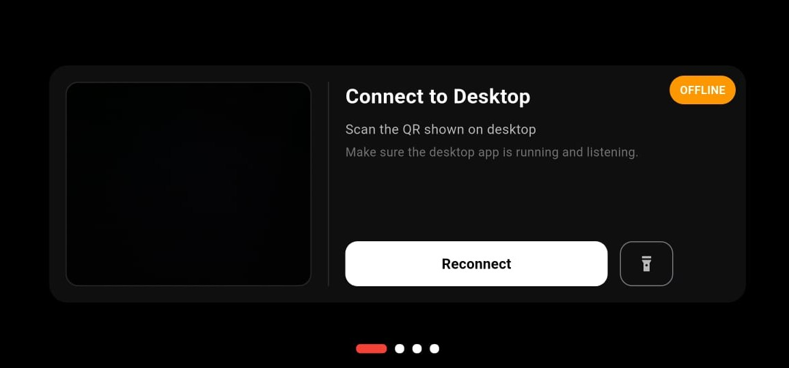
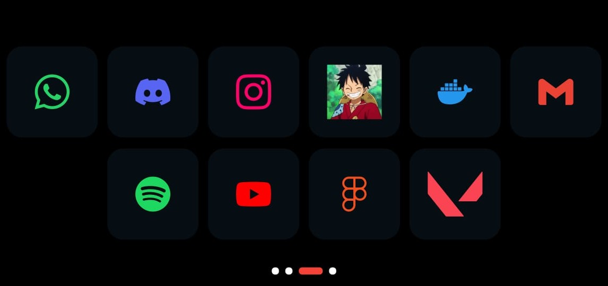
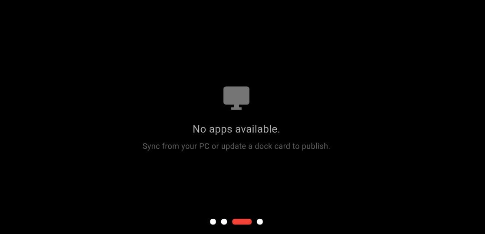

<h1>
  MobileDeck
</h1>

  
  
  

  
  
  

<i>Seamless control across devices — your desktop, reimagined.</i>

---

## 🚀 MobileDeck v1.1.0.0-alpha — Stats & Stability Upgrade

**MobileDeck v1.1.0.0-alpha** introduces the **first functional hardware stats panel**, providing real-time CPU and GPU telemetry directly on your mobile device.

This release focuses on:
- Hardware monitoring
- Stability improvements
- Reliable communication

This repository contains **release builds only**.  
Source code remains private.

---

## 📌 What is MobileDeck?

**MobileDeck** is a desktop companion application that allows you to monitor and control your PC using your phone.

It is designed for:
- 🎮 **Gamers** who need quick access without alt-tabbing
- 🧪 **PC testers** who require hardware telemetry
- 👨‍💻 **Developers** who want efficient remote controls

MobileDeck prioritizes **performance and privacy** without subscriptions or bloat.

---

## 🛠 First-Time Setup (How It Works)

1. **Launch the Desktop App**
2. Click **Connect** to show the QR code
3. Open the Mobile App and **scan the QR**
4. **Approve the device** on desktop
5. **Connected 🎉**

No manual network configuration required.

---

## ✨ New in v1.1.0.0-alpha

### 📊 **System Hardware Statistics**
Stats are now **enabled and functional**, displaying:

#### **CPU Metrics**
- Temperature
- Load %
- Power draw
- RAM usage

#### **GPU Metrics**
- Temperature
- Load %
- VRAM usage
- Power draw

Data updates in **real-time** for performance monitoring.

### ⚙️ **Stability Improvements**
- Fixed **frequent disconnects**
- Improved mobile ↔ desktop socket reliability
- Reduced UI freezes during intensive polling
- Cleaner service lifecycle handling

---

## 📱 Mobile App Status

Available screens:

- 📊 **Stats Screen** → **Fully functional**
- ⚙️ **Quick Settings** → **Not yet linked**

More functionality will be enabled in upcoming builds.

---

## ✨ Features from Previous Release (v1.0.0)

- 🧩 **Customizable App Dock**
- 📱 **Secure QR Pairing**
- ⚡ **Background Service**
- 🎨 **Clean & Immersive UI**

These remain available in **v1.1.0.0-alpha**.

---

## 🖼 Screenshots

### 🖥 Desktop App

<table>
  <tr>
    <td></td>
    <td></td>
  </tr>
  <tr>
    <td></td>
    <td></td>
  </tr>
  <tr>
    <td></td>
    <td></td>
  </tr>
</table>

### 📱 Mobile App

<table cellspacing="24">
  <tr>
    <td></td>
    <td></td>
  </tr>
  <tr>
    <td></td>
    <td></td>
  </tr>
</table>

---

## 🔜 Coming Soon

- ⚙️ **Quick Settings**
  - Volume
  - Brightness
  - System toggles

- 🎯 **Custom Actions**
  - Media controls
  - Shortcuts
  - Macros

---

## 🧪 Release Notes

- Version: **v1.1.0.0-alpha**
- Stage: **Alpha Test Build**
- Platform: **Windows (x64)**

Minor issues may exist depending on hardware support.

---

<b>Welcome to MobileDeck 🚀</b> 
More features and improvements are on the way.

